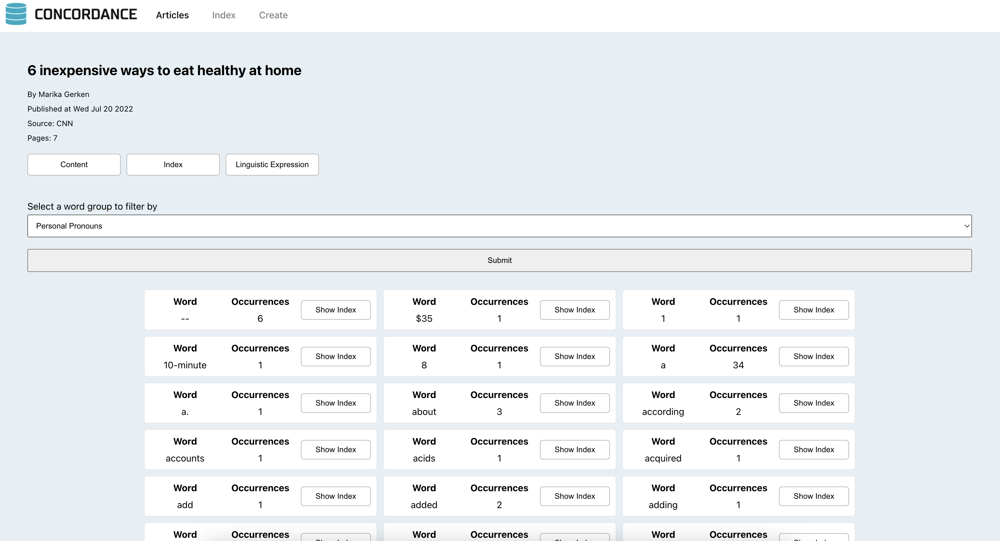

# Concordance
Concordance is a website that provides concordance services for online articles. It was developed as part of a databases workshop at the Open University. The project utilizes Golang for the backend, React for the frontend, and PostgreSQL for the database.



## Local Development

### Prerequisites

* Golang 18 or later.
* NPM and Node.js.
* Postgres 14.10 or later.  

Note: The project may work with earlier versions, but it's not guaranteed.

### Installation

1. Clone the repository to your local machine:
    ```sh
    git clone https://github.com/ozhey/concordance.git
    ```
2. Set up the database:  
    * Create a new PostgreSQL database using Docker:
      ```sh
      docker run --name concordanceDB -p 5433:5432 -e POSTGRES_USER=admin -e POSTGRES_PASSWORD=admin -e POSTGRES_DB=concordance -d postgres
      ```
    * If you prefer a different method to create the database (e.g., not using docker), you might need to update the database credentials in the .env file.
3. Start the backend server:  
    * Navigate to the backend directory and run the server:
      ```sh
        go mod tidy
        go run cmd/main/main.go
      ```  
4. Start the frontend server:
    * Navigate to the frontend directory.
    * Install dependencies: `npm install`.
    * Start the server: `npm start`.
5. Open the website:
    * Open a web browser and go to http://localhost:3000.

### Performance Benchmark Tests

The server includes a `/benchmark` API endpoint for testing the performance of the database. This endpoint fetches a word index for an article multiple times under varying database sizes.

> [!WARNING]  
> Running the /benchmark API endpoint will reset the database, resulting in the loss of all data.

The endpoint accepts two parameters:
* `replicates`: the number of times the test will run.
* `db_size`: the number of times the database will be duplicated before running the test.

Results returned include the time taken to create the database with all indexes, the average query time, and the individual times for all queries.

To configure the project with different types and amounts of indexes for performance testing, switch the structs under /controller/database/models.go with one of the sets from ./models_benchmark_vars.txt. Copy the desired set from the latter file and override all corresponding structs in models.go. Finally, restart the server and rerun the test.